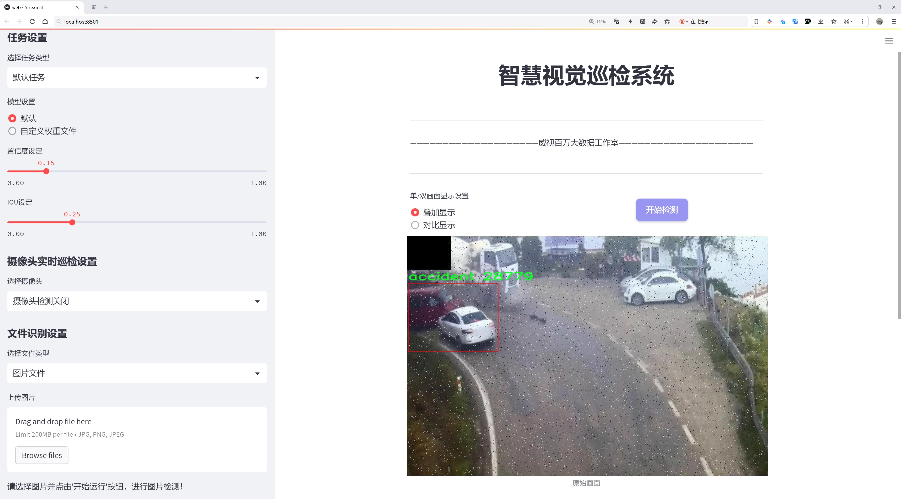
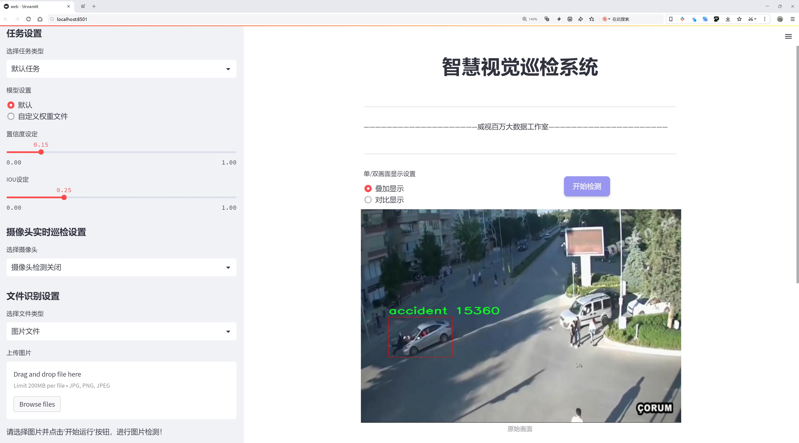
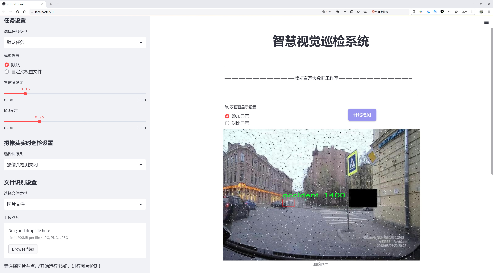
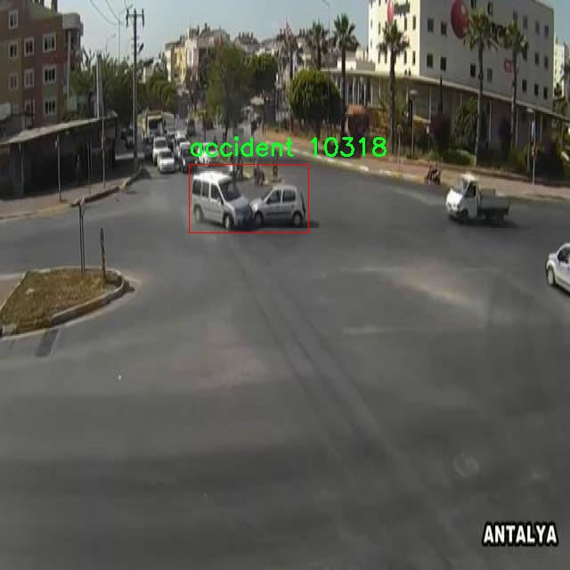
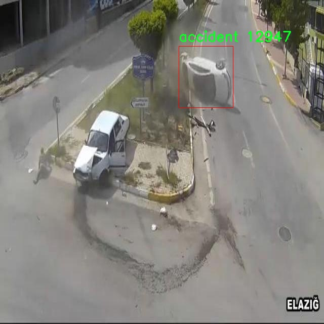
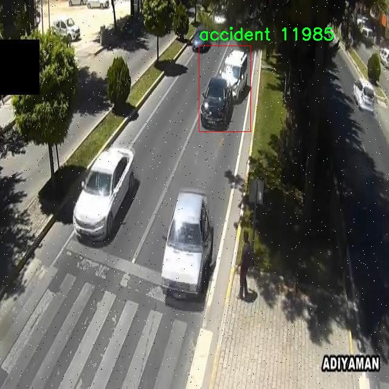
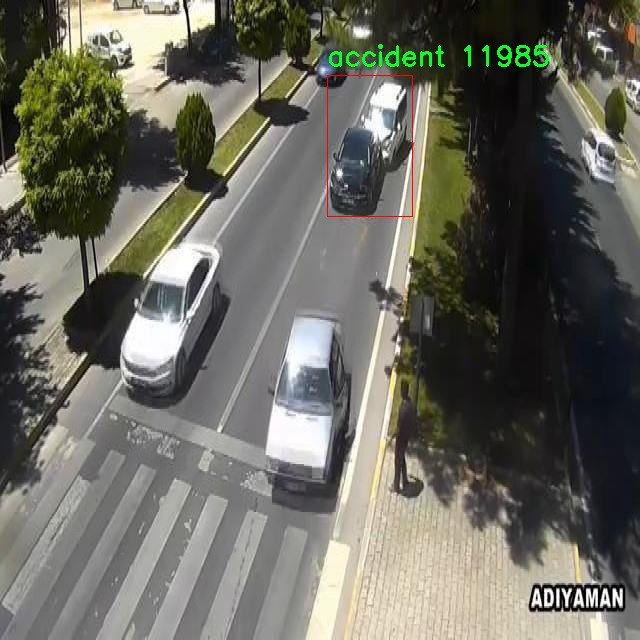
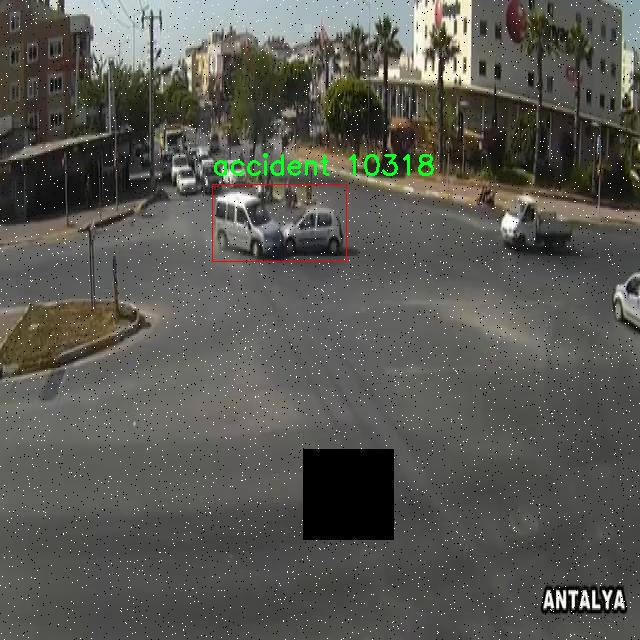

# 交通事故检测检测系统源码分享
 # [一条龙教学YOLOV8标注好的数据集一键训练_70+全套改进创新点发刊_Web前端展示]

### 1.研究背景与意义

项目参考[AAAI Association for the Advancement of Artificial Intelligence](https://gitee.com/qunmasj/projects)

项目来源[AACV Association for the Advancement of Computer Vision](https://kdocs.cn/l/cszuIiCKVNis)

研究背景与意义

随着城市化进程的加快和机动车数量的不断增加，交通事故的发生频率逐年上升，给社会带来了巨大的经济损失和人身伤害。根据相关统计数据，交通事故已成为全球范围内导致死亡和伤残的重要原因之一。因此，如何有效地监测和预防交通事故，成为了交通管理和公共安全领域亟待解决的重要课题。传统的交通事故监测方法多依赖于人工巡查和监控摄像头的实时监控，这不仅效率低下，而且容易受到人为因素的影响，难以实现对事故的快速响应和处理。

近年来，随着深度学习技术的迅猛发展，基于计算机视觉的自动化交通事故检测系统逐渐成为研究热点。YOLO（You Only Look Once）系列模型因其高效的实时目标检测能力而受到广泛关注。YOLOv8作为该系列的最新版本，进一步提升了检测精度和速度，为交通事故的自动化检测提供了新的可能性。然而，现有的YOLOv8模型在特定场景下的应用仍存在一定的局限性，尤其是在复杂的交通环境中，事故的检测准确性和实时性亟需改进。

本研究旨在基于改进的YOLOv8模型，构建一个高效的交通事故检测系统。为此，我们将利用一个包含2100张图像的专用数据集，该数据集专注于交通事故的检测，包含一个类别“accident”。通过对该数据集的深入分析和处理，我们可以为模型的训练提供丰富的样本数据，从而提高模型的泛化能力和检测准确性。通过对数据集的标注和预处理，我们将确保模型能够在不同的交通场景中有效识别事故发生的情况。

本研究的意义不仅在于提升交通事故检测的技术水平，更在于为交通管理部门提供一种高效、智能的事故监测工具，进而推动交通安全管理的智能化发展。通过实现对交通事故的实时监测与预警，能够有效降低事故发生率，减少人员伤亡和财产损失。同时，该系统的成功应用还将为其他领域的目标检测提供借鉴，推动计算机视觉技术在更广泛场景中的应用。

总之，基于改进YOLOv8的交通事故检测系统的研究，不仅具有重要的理论价值，还有着显著的实际应用意义。通过对交通事故的精准检测与分析，我们能够为城市交通管理提供科学依据，助力构建更加安全、高效的交通环境。

### 2.图片演示







##### 注意：由于此博客编辑较早，上面“2.图片演示”和“3.视频演示”展示的系统图片或者视频可能为老版本，新版本在老版本的基础上升级如下：（实际效果以升级的新版本为准）

  （1）适配了YOLOV8的“目标检测”模型和“实例分割”模型，通过加载相应的权重（.pt）文件即可自适应加载模型。

  （2）支持“图片识别”、“视频识别”、“摄像头实时识别”三种识别模式。

  （3）支持“图片识别”、“视频识别”、“摄像头实时识别”三种识别结果保存导出，解决手动导出（容易卡顿出现爆内存）存在的问题，识别完自动保存结果并导出到tempDir中。

  （4）支持Web前端系统中的标题、背景图等自定义修改，后面提供修改教程。

  另外本项目提供训练的数据集和训练教程,暂不提供权重文件（best.pt）,需要您按照教程进行训练后实现图片演示和Web前端界面演示的效果。

### 3.视频演示

[3.1 视频演示](https://www.bilibili.com/video/BV1jo4PevE2g/)

### 4.数据集信息展示

##### 4.1 本项目数据集详细数据（类别数＆类别名）

nc: 1
names: ['accident']


##### 4.2 本项目数据集信息介绍

数据集信息展示

在本研究中，我们采用了名为“acc”的数据集，以支持改进YOLOv8的交通事故检测系统的训练与评估。该数据集专注于交通事故的识别与分类，旨在为智能交通系统的安全性和效率提供更为精准的技术支持。数据集的设计理念是通过高质量的标注和丰富的样本，提升模型在实际应用中的表现，尤其是在复杂的交通环境中。

“acc”数据集的类别数量为1，具体类别为“accident”。这一单一类别的设置，旨在集中关注交通事故的检测与识别，确保模型能够在各种场景下准确捕捉到事故发生的瞬间。通过对事故场景的多样化采集和标注，数据集涵盖了不同类型的交通事故，包括但不限于车辆碰撞、翻车、追尾等情况。这种多样性不仅能够提高模型的泛化能力，还能帮助研究人员深入理解不同事故类型的特征与规律。

数据集的构建过程严格遵循数据采集和标注的高标准，确保每一张图像都经过精确的标注，以便为YOLOv8模型提供可靠的训练基础。数据集中的图像来源于多种交通环境，包括城市道路、高速公路和乡村道路等，涵盖了不同的天气条件和时间段。这种多样化的场景设置，旨在模拟真实世界中可能遇到的各种情况，从而提高模型在实际应用中的适应性和鲁棒性。

在数据集的标注过程中，研究团队采用了先进的图像处理技术，确保每个事故场景的细节都被充分捕捉。每张图像中，事故发生的区域被精确框定，并标注为“accident”，为模型提供了清晰的学习目标。这种高质量的标注不仅提高了模型的训练效率，也为后续的模型评估提供了可靠的基准。

为了确保数据集的有效性和实用性，研究团队还进行了多轮的数据清洗和验证，剔除不符合标准的样本，确保数据集的整体质量。此外，数据集的使用也遵循了相关的伦理规范，确保所有图像的采集和使用均符合隐私保护的要求。

在训练过程中，YOLOv8模型将利用“acc”数据集进行多次迭代，以不断优化其在交通事故检测中的表现。通过对数据集的深入分析和模型的持续调优，研究团队期望能够显著提升模型在复杂交通场景中的检测准确率和响应速度，为未来的智能交通系统提供更为可靠的技术支持。

总之，“acc”数据集不仅为本研究提供了坚实的基础，也为未来在交通事故检测领域的研究与应用奠定了重要的理论和实践基础。通过不断的探索与创新，研究团队期待能够推动交通安全技术的发展，为社会的安全出行贡献一份力量。











### 5.全套项目环境部署视频教程（零基础手把手教学）

[5.1 环境部署教程链接（零基础手把手教学）](https://www.ixigua.com/7404473917358506534?logTag=c807d0cbc21c0ef59de5)


[5.2 安装Python虚拟环境创建和依赖库安装视频教程链接（零基础手把手教学）](https://www.ixigua.com/7404474678003106304?logTag=1f1041108cd1f708b01a)

### 6.手把手YOLOV8训练视频教程（零基础小白有手就能学会）

[6.1 手把手YOLOV8训练视频教程（零基础小白有手就能学会）](https://www.ixigua.com/7404477157818401292?logTag=d31a2dfd1983c9668658)

### 7.70+种全套YOLOV8创新点代码加载调参视频教程（一键加载写好的改进模型的配置文件）

[7.1 70+种全套YOLOV8创新点代码加载调参视频教程（一键加载写好的改进模型的配置文件）](https://www.ixigua.com/7404478314661806627?logTag=29066f8288e3f4eea3a4)

### 8.70+种全套YOLOV8创新点原理讲解（非科班也可以轻松写刊发刊，V10版本正在科研待更新）

由于篇幅限制，每个创新点的具体原理讲解就不一一展开，具体见下列网址中的创新点对应子项目的技术原理博客网址【Blog】：


[8.1 70+种全套YOLOV8创新点原理讲解链接](https://gitee.com/qunmasj/good)

### 9.系统功能展示（检测对象为举例，实际内容以本项目数据集为准）

图9.1.系统支持检测结果表格显示

  图9.2.系统支持置信度和IOU阈值手动调节

  图9.3.系统支持自定义加载权重文件best.pt(需要你通过步骤5中训练获得)

  图9.4.系统支持摄像头实时识别

  图9.5.系统支持图片识别

  图9.6.系统支持视频识别

  图9.7.系统支持识别结果文件自动保存

  图9.8.系统支持Excel导出检测结果数据


### 10.原始YOLOV8算法原理

原始YOLOv8算法原理

YOLOv8是2023年1月10日发布的最新一代目标检测模型，标志着YOLO系列的又一次重大进步。作为计算机视觉领域中用于分类、检测和分割任务的最先进模型，YOLOv8在精度和执行时间方面都超越了所有已知的模型，成为了当前的“王者”。该模型不仅借鉴了YOLOv5、YOLOv6和YOLOX等前辈的设计优点，还在此基础上进行了全面的提升和改进，同时保持了YOLOv5在工程化和易用性方面的优势。

YOLOv8的设计理念围绕着高效性和准确性展开，采用了多项创新技术。首先，YOLOv8的骨干网络进行了重新设计，取代了YOLOv5中的6x6卷积核，改为更小的3x3卷积核，这一变化不仅减少了计算量，还提高了特征提取的精度。其次，YOLOv8将所有的C3模块替换为C2f模块，C2f模块通过增加跳层连接和Split操作，增强了特征的重用性和信息流动性，进而提高了模型的学习能力。此外，YOLOv8在主干网络中将C2f的块数从3-6-9-3调整为3-6-6-3，进一步优化了网络结构，提升了性能。

在特征融合方面，YOLOv8采用了PAN-FPN（Path Aggregation Network with Feature Pyramid Network）结构，这一设计使得不同尺度的特征图能够有效融合，提升了模型对多尺度目标的检测能力。通过上采样和下采样的结合，YOLOv8能够在不同层次上提取和融合特征，从而增强对目标的感知能力。

YOLOv8的另一个显著创新是引入了Anchor-Free检测头，这一设计抛弃了传统的Anchor-Based方法，简化了目标检测的过程。解耦头的使用使得分类和回归过程可以独立进行，减少了模型的复杂性，同时提高了检测精度。具体而言，YOLOv8的Head部分不再有objectness分支，而是通过解耦的分类和回归分支来实现目标的检测。这种方法不仅提升了模型的灵活性，还减少了训练过程中的样本匹配难度。

在损失函数的设计上，YOLOv8也进行了创新，采用了VFLLoss作为分类损失，并结合DFLLoss和CIoULoss来计算回归损失。这一组合使得模型在面对复杂的样本分布时，能够更好地进行学习和优化，提升了模型的泛化能力和准确性。

YOLOv8的输入端通过Mosaic数据增强、自适应图片缩放和灰度填充等方式对输入图像进行预处理，确保了模型在训练过程中的数据多样性和鲁棒性。主干网络通过卷积、池化等操作提取图像特征，而Neck端则通过PAN结构对不同尺度的特征图进行融合，确保了信息的充分利用。

在实际应用中，YOLOv8的表现令人瞩目。它不仅在COCOVal2017数据集上取得了更高的mAP（Mean Average Precision），而且在训练速度上也显著提升。这使得YOLOv8在实时目标检测任务中表现得尤为出色，能够满足各类应用场景的需求。

总的来说，YOLOv8通过对网络结构的全面优化、创新的Anchor-Free检测头、改进的损失函数以及高效的特征融合策略，成功地提升了目标检测的精度和速度。这些创新使得YOLOv8不仅在理论上具有重要意义，更在实际应用中展现出强大的能力，成为计算机视觉领域中的一颗璀璨明珠。随着YOLOv8的推出，目标检测技术的未来无疑将迎来更多的可能性和挑战。


### 11.项目核心源码讲解（再也不用担心看不懂代码逻辑）

#### 11.1 ui.py

以下是经过精简和注释的核心代码：

```python
import sys
import subprocess
from QtFusion.path import abs_path

def run_script(script_path):
    """
    使用当前 Python 环境运行指定的脚本。

    Args:
        script_path (str): 要运行的脚本路径
    """
    # 获取当前 Python 解释器的路径
    python_path = sys.executable

    # 构建运行命令，使用 streamlit 运行指定的脚本
    command = f'"{python_path}" -m streamlit run "{script_path}"'

    # 执行命令并等待其完成
    result = subprocess.run(command, shell=True)
    
    # 检查命令执行的返回码，0 表示成功，非0表示出错
    if result.returncode != 0:
        print("脚本运行出错。")

# 主程序入口
if __name__ == "__main__":
    # 获取脚本的绝对路径
    script_path = abs_path("web.py")

    # 运行指定的脚本
    run_script(script_path)
```

### 代码说明：
1. **导入模块**：
   - `sys`：用于获取当前 Python 解释器的路径。
   - `subprocess`：用于执行外部命令。
   - `abs_path`：从 `QtFusion.path` 导入的函数，用于获取文件的绝对路径。

2. **`run_script` 函数**：
   - 接收一个脚本路径作为参数。
   - 获取当前 Python 解释器的路径。
   - 构建运行命令，使用 `streamlit` 模块来运行指定的脚本。
   - 使用 `subprocess.run` 执行命令，并等待其完成。
   - 检查命令的返回码，若不为0，则输出错误信息。

3. **主程序入口**：
   - 使用 `abs_path` 获取 `web.py` 的绝对路径。
   - 调用 `run_script` 函数来运行该脚本。

这个程序文件名为 `ui.py`，其主要功能是运行一个指定的 Python 脚本，具体是使用 Streamlit 框架来启动一个 Web 应用。

首先，文件中导入了一些必要的模块，包括 `sys`、`os` 和 `subprocess`。`sys` 模块用于访问与 Python 解释器紧密相关的变量和函数，`os` 模块提供了与操作系统交互的功能，而 `subprocess` 模块则用于在 Python 中启动新进程、连接到它们的输入/输出/错误管道，并获取它们的返回码。

接下来，文件中定义了一个名为 `run_script` 的函数，该函数接受一个参数 `script_path`，表示要运行的脚本的路径。在函数内部，首先获取当前 Python 解释器的路径，存储在 `python_path` 变量中。然后，构建一个命令字符串，使用 `streamlit run` 命令来运行指定的脚本。这个命令将会在命令行中执行。

随后，使用 `subprocess.run` 方法来执行构建好的命令。该方法的 `shell=True` 参数表示命令将在一个新的 shell 中执行。执行完命令后，检查返回码，如果返回码不为零，表示脚本运行出错，此时会打印出错误信息。

在文件的最后部分，使用 `if __name__ == "__main__":` 语句来确保只有在直接运行该脚本时才会执行以下代码。这部分代码中，首先调用 `abs_path` 函数来获取名为 `web.py` 的脚本的绝对路径，并将其存储在 `script_path` 变量中。最后，调用 `run_script` 函数来运行这个脚本。

总的来说，这个 `ui.py` 文件的作用是提供一个简单的接口，通过命令行运行一个 Streamlit Web 应用，便于开发者快速启动和测试他们的 Web 应用。

#### 11.2 70+种YOLOv8算法改进源码大全和调试加载训练教程（非必要）\ultralytics\engine\results.py

以下是经过简化并注释的核心代码部分，主要包括 `BaseTensor`、`Results`、`Boxes`、`Masks`、`Keypoints` 和 `Probs` 类。这些类是处理推理结果的基础。

```python
import numpy as np
import torch

class BaseTensor:
    """基础张量类，提供便捷的张量操作和设备管理方法。"""

    def __init__(self, data, orig_shape) -> None:
        """
        初始化 BaseTensor，包含数据和原始形状。

        Args:
            data (torch.Tensor | np.ndarray): 预测结果，如边界框、掩码和关键点。
            orig_shape (tuple): 图像的原始形状。
        """
        assert isinstance(data, (torch.Tensor, np.ndarray))
        self.data = data  # 存储预测数据
        self.orig_shape = orig_shape  # 存储原始图像形状

    def cpu(self):
        """返回一个在 CPU 内存上的张量副本。"""
        return self if isinstance(self.data, np.ndarray) else self.__class__(self.data.cpu(), self.orig_shape)

    def numpy(self):
        """返回一个作为 numpy 数组的张量副本。"""
        return self if isinstance(self.data, np.ndarray) else self.__class__(self.data.numpy(), self.orig_shape)

    def cuda(self):
        """返回一个在 GPU 内存上的张量副本。"""
        return self.__class__(torch.as_tensor(self.data).cuda(), self.orig_shape)

    def __len__(self):
        """返回数据张量的长度。"""
        return len(self.data)

    def __getitem__(self, idx):
        """返回指定索引的数据张量。"""
        return self.__class__(self.data[idx], self.orig_shape)


class Results:
    """存储和操作推理结果的类。"""

    def __init__(self, orig_img, path, names, boxes=None, masks=None, probs=None, keypoints=None) -> None:
        """初始化 Results 类。"""
        self.orig_img = orig_img  # 原始图像
        self.orig_shape = orig_img.shape[:2]  # 原始图像形状
        self.boxes = Boxes(boxes, self.orig_shape) if boxes is not None else None  # 边界框
        self.masks = Masks(masks, self.orig_shape) if masks is not None else None  # 掩码
        self.probs = Probs(probs) if probs is not None else None  # 分类概率
        self.keypoints = Keypoints(keypoints, self.orig_shape) if keypoints is not None else None  # 关键点
        self.names = names  # 类别名称
        self.path = path  # 图像文件路径

    def update(self, boxes=None, masks=None, probs=None):
        """更新 Results 对象的边界框、掩码和概率属性。"""
        if boxes is not None:
            self.boxes = Boxes(boxes, self.orig_shape)  # 更新边界框
        if masks is not None:
            self.masks = Masks(masks, self.orig_shape)  # 更新掩码
        if probs is not None:
            self.probs = probs  # 更新概率

    def plot(self):
        """在输入图像上绘制检测结果。"""
        # 绘制逻辑省略，通常会使用图像处理库将检测结果绘制到图像上
        pass


class Boxes(BaseTensor):
    """存储和操作检测边界框的类。"""

    def __init__(self, boxes, orig_shape) -> None:
        """初始化 Boxes 类。"""
        super().__init__(boxes, orig_shape)

    @property
    def xyxy(self):
        """返回边界框的 xyxy 格式。"""
        return self.data[:, :4]  # 返回前四列作为边界框坐标


class Masks(BaseTensor):
    """存储和操作检测掩码的类。"""

    def __init__(self, masks, orig_shape) -> None:
        """初始化 Masks 类。"""
        super().__init__(masks, orig_shape)

    @property
    def xyn(self):
        """返回归一化的掩码段。"""
        # 具体实现省略，通常会将掩码转换为归一化坐标
        pass


class Keypoints(BaseTensor):
    """存储和操作检测关键点的类。"""

    def __init__(self, keypoints, orig_shape) -> None:
        """初始化 Keypoints 类。"""
        super().__init__(keypoints, orig_shape)

    @property
    def xy(self):
        """返回关键点的 x, y 坐标。"""
        return self.data[..., :2]  # 返回前两列作为关键点坐标


class Probs(BaseTensor):
    """存储和操作分类预测的类。"""

    def __init__(self, probs, orig_shape=None) -> None:
        """初始化 Probs 类。"""
        super().__init__(probs, orig_shape)

    @property
    def top1(self):
        """返回 top 1 类别的索引。"""
        return int(self.data.argmax())  # 返回最大概率的索引
```

### 代码说明
1. **BaseTensor**: 这是一个基础类，提供了对张量的基本操作，如在 CPU 和 GPU 之间移动数据、转换为 numpy 数组等。
2. **Results**: 这个类用于存储推理结果，包括原始图像、边界框、掩码、概率和关键点等信息，并提供更新和绘制结果的方法。
3. **Boxes**: 这个类专门用于处理检测到的边界框，提供获取边界框坐标的方法。
4. **Masks**: 这个类用于处理检测到的掩码，提供获取归一化掩码段的方法。
5. **Keypoints**: 这个类用于处理检测到的关键点，提供获取关键点坐标的方法。
6. **Probs**: 这个类用于处理分类概率，提供获取最高概率类别的方法。

这些类的设计使得处理推理结果变得更加方便和高效。

这个程序文件是一个用于处理YOLOv8模型推理结果的模块，主要包括结果、边界框、掩码、关键点和分类概率等类的定义和实现。文件的主要功能是接收模型的推理结果，并提供一系列方法来处理和可视化这些结果。

首先，`BaseTensor`类是一个基础类，提供了一些便捷的方法来处理张量数据，包括在不同设备（CPU、GPU）之间的转换，以及将张量转换为NumPy数组等。这个类的构造函数接收数据和原始图像的形状，并定义了一些属性和方法，例如获取张量的形状、长度和索引等。

接下来是`Results`类，它用于存储和操作推理结果。这个类的构造函数接收原始图像、文件路径、类别名称以及可选的边界框、掩码、概率和关键点数据。它还包含了更新结果、获取结果长度、将结果转换为不同设备等方法。此外，`Results`类还提供了可视化推理结果的`plot`方法，可以在输入图像上绘制检测结果，包括边界框、掩码、关键点和分类概率等。

`Boxes`、`Masks`、`Keypoints`和`Probs`类分别用于处理检测到的边界框、掩码、关键点和分类概率。每个类都继承自`BaseTensor`，并提供特定于各自数据类型的方法和属性。例如，`Boxes`类可以返回边界框的坐标、置信度和类别信息，`Masks`类则处理掩码的像素坐标和归一化坐标，`Keypoints`类用于处理关键点的坐标和置信度，而`Probs`类则用于处理分类的概率信息。

整个模块的设计旨在简化YOLOv8模型推理结果的处理流程，使得用户能够方便地获取、更新和可视化推理结果，同时也支持将结果保存为文本文件或JSON格式，以便后续分析和使用。通过这些类和方法，用户可以轻松地处理复杂的推理结果，进行进一步的分析和应用。

#### 11.3 70+种YOLOv8算法改进源码大全和调试加载训练教程（非必要）\ultralytics\models\rtdetr\predict.py

以下是代码中最核心的部分，并附上详细的中文注释：

```python
import torch
from ultralytics.data.augment import LetterBox
from ultralytics.engine.predictor import BasePredictor
from ultralytics.engine.results import Results
from ultralytics.utils import ops

class RTDETRPredictor(BasePredictor):
    """
    RT-DETR（实时检测变换器）预测器，扩展自BasePredictor类，用于使用百度的RT-DETR模型进行预测。
    该类利用视觉变换器的强大功能，提供实时物体检测，同时保持高精度。
    """

    def postprocess(self, preds, img, orig_imgs):
        """
        对模型的原始预测结果进行后处理，以生成边界框和置信度分数。

        Args:
            preds (torch.Tensor): 模型的原始预测结果。
            img (torch.Tensor): 处理后的输入图像。
            orig_imgs (list or torch.Tensor): 原始未处理的图像。

        Returns:
            (list[Results]): 包含后处理后的边界框、置信度分数和类别标签的Results对象列表。
        """
        # 获取预测结果的维度
        nd = preds[0].shape[-1]
        # 将预测结果分为边界框和分数
        bboxes, scores = preds[0].split((4, nd - 4), dim=-1)

        # 如果输入图像不是列表，则将其转换为numpy数组
        if not isinstance(orig_imgs, list):
            orig_imgs = ops.convert_torch2numpy_batch(orig_imgs)

        results = []
        # 遍历每个边界框
        for i, bbox in enumerate(bboxes):
            # 将边界框从xywh格式转换为xyxy格式
            bbox = ops.xywh2xyxy(bbox)
            # 获取每个边界框的最大分数和对应的类别
            score, cls = scores[i].max(-1, keepdim=True)
            # 根据置信度过滤边界框
            idx = score.squeeze(-1) > self.args.conf
            # 如果指定了类别，则进一步过滤
            if self.args.classes is not None:
                idx = (cls == torch.tensor(self.args.classes, device=cls.device)).any(1) & idx
            # 过滤后的预测结果
            pred = torch.cat([bbox, score, cls], dim=-1)[idx]
            orig_img = orig_imgs[i]
            oh, ow = orig_img.shape[:2]
            # 将边界框的坐标调整为原始图像的尺寸
            pred[..., [0, 2]] *= ow
            pred[..., [1, 3]] *= oh
            img_path = self.batch[0][i]
            # 将结果添加到结果列表中
            results.append(Results(orig_img, path=img_path, names=self.model.names, boxes=pred))
        return results

    def pre_transform(self, im):
        """
        在将输入图像输入模型进行推理之前，对其进行预处理。输入图像被调整为正方形以确保宽高比。

        Args:
            im (list[np.ndarray] | torch.Tensor): 输入图像，形状为(N,3,h,w)的张量，或[(h,w,3) x N]的列表。

        Returns:
            (list): 预处理后的图像列表，准备好进行模型推理。
        """
        # 创建LetterBox对象以进行图像调整
        letterbox = LetterBox(self.imgsz, auto=False, scaleFill=True)
        # 对每个图像进行调整并返回
        return [letterbox(image=x) for x in im]
```

### 代码说明：
1. **RTDETRPredictor类**：这是一个用于实时物体检测的预测器，继承自`BasePredictor`类，利用百度的RT-DETR模型进行预测。
2. **postprocess方法**：对模型的原始预测结果进行后处理，生成边界框和置信度分数，并根据置信度和类别进行过滤。
3. **pre_transform方法**：对输入图像进行预处理，确保其为正方形并适合模型输入。

该程序文件是Ultralytics YOLO框架中的一个预测模块，专门用于实现RT-DETR（实时检测变换器）模型的预测功能。RT-DETR模型结合了视觉变换器的优势，旨在提供高效的实时目标检测，同时保持较高的准确性。该类继承自BasePredictor类，包含了进行预测所需的主要功能。

在文件开头，导入了必要的库和模块，包括PyTorch、数据增强工具、基本预测器类、结果处理类以及一些实用操作函数。RTDETRPredictor类中定义了多个方法，以处理模型的输入和输出。

类的构造函数中定义了两个主要属性：imgsz和args。imgsz表示推理时使用的图像大小，要求为正方形并且需要填充；args则是用于覆盖预测器参数的字典。

postprocess方法负责对模型的原始预测结果进行后处理，生成边界框和置信度分数。该方法首先从模型的预测结果中分离出边界框和分数，然后根据置信度和类别进行过滤。处理后的结果包括边界框、置信度和类别标签，并将其封装在Results对象中返回。

pre_transform方法用于在将输入图像传入模型进行推理之前进行预处理。该方法使用LetterBox类将输入图像调整为正方形，并确保填充到指定大小。该方法接受的输入可以是张量或列表，返回的是经过预处理的图像列表，准备好进行模型推理。

整体而言，该文件实现了RT-DETR模型的预测功能，提供了从输入图像预处理到输出结果后处理的完整流程，适用于需要实时目标检测的应用场景。

#### 11.4 code\ultralytics\models\sam\model.py

以下是代码中最核心的部分，并附上详细的中文注释：

```python
from pathlib import Path  # 导入Path类，用于处理文件路径

from ultralytics.engine.model import Model  # 从Ultralytics引擎导入Model基类
from .build import build_sam  # 导入构建SAM模型的函数
from .predict import Predictor  # 导入预测器类

class SAM(Model):
    """
    SAM（Segment Anything Model）接口类。

    SAM旨在实现可提示的实时图像分割。可以使用多种提示方式，如边界框、点或标签。该模型具有零-shot性能，并在SA-1B数据集上进行训练。
    """

    def __init__(self, model="sam_b.pt") -> None:
        """
        使用预训练模型文件初始化SAM模型。

        参数:
            model (str): 预训练SAM模型文件的路径。文件应具有.pt或.pth扩展名。

        异常:
            NotImplementedError: 如果模型文件扩展名不是.pt或.pth。
        """
        # 检查模型文件扩展名是否有效
        if model and Path(model).suffix not in (".pt", ".pth"):
            raise NotImplementedError("SAM预测需要预训练的*.pt或*.pth模型。")
        super().__init__(model=model, task="segment")  # 调用父类构造函数

    def predict(self, source, stream=False, bboxes=None, points=None, labels=None, **kwargs):
        """
        对给定的图像或视频源执行分割预测。

        参数:
            source (str): 图像或视频文件的路径，或PIL.Image对象，或numpy.ndarray对象。
            stream (bool, optional): 如果为True，则启用实时流。默认为False。
            bboxes (list, optional): 提示分割的边界框坐标列表。默认为None。
            points (list, optional): 提示分割的点列表。默认为None。
            labels (list, optional): 提示分割的标签列表。默认为None。

        返回:
            (list): 模型的预测结果。
        """
        # 设置预测的覆盖参数
        overrides = dict(conf=0.25, task="segment", mode="predict", imgsz=1024)
        kwargs.update(overrides)  # 更新额外参数
        prompts = dict(bboxes=bboxes, points=points, labels=labels)  # 收集提示信息
        return super().predict(source, stream, prompts=prompts, **kwargs)  # 调用父类的预测方法

    def __call__(self, source=None, stream=False, bboxes=None, points=None, labels=None, **kwargs):
        """
        'predict'方法的别名。

        参数:
            source (str): 图像或视频文件的路径，或PIL.Image对象，或numpy.ndarray对象。
            stream (bool, optional): 如果为True，则启用实时流。默认为False。
            bboxes (list, optional): 提示分割的边界框坐标列表。默认为None。
            points (list, optional): 提示分割的点列表。默认为None。
            labels (list, optional): 提示分割的标签列表。默认为None。

        返回:
            (list): 模型的预测结果。
        """
        return self.predict(source, stream, bboxes, points, labels, **kwargs)  # 调用预测方法

    def info(self, detailed=False, verbose=True):
        """
        记录有关SAM模型的信息。

        参数:
            detailed (bool, optional): 如果为True，则显示有关模型的详细信息。默认为False。
            verbose (bool, optional): 如果为True，则在控制台上显示信息。默认为True。

        返回:
            (tuple): 包含模型信息的元组。
        """
        return model_info(self.model, detailed=detailed, verbose=verbose)  # 获取模型信息

    @property
    def task_map(self):
        """
        提供从'segment'任务到其对应'预测器'的映射。

        返回:
            (dict): 将'segment'任务映射到其对应'预测器'的字典。
        """
        return {"segment": {"predictor": Predictor}}  # 返回任务映射
```

### 代码核心部分解释：
1. **SAM类**：这是一个继承自`Model`的类，专门用于实现可提示的实时图像分割功能。
2. **初始化方法**：构造函数接受一个模型文件路径，确保文件扩展名正确。
3. **预测方法**：`predict`方法实现了对图像或视频源的分割预测，支持实时流和多种提示方式（边界框、点、标签）。
4. **调用方法**：`__call__`方法允许用户通过调用类实例来进行预测，实际上是调用了`predict`方法。
5. **信息方法**：`info`方法用于获取模型的详细信息。
6. **任务映射**：`task_map`属性提供了任务与预测器之间的映射关系。

这个程序文件是Ultralytics YOLO框架中的一个模块，专门用于实现“Segment Anything Model”（SAM），旨在进行实时图像分割任务。SAM模型具有极高的灵活性，能够根据不同的提示进行分割，并且经过SA-1B数据集的训练，具备零-shot性能，能够适应新的图像分布和任务，而无需事先的知识。

在文件开头，首先引入了一些必要的库和模块，包括`Path`用于处理文件路径，`Model`类用于创建模型的基础，`model_info`用于获取模型信息，`build_sam`用于构建SAM模型，`Predictor`用于进行预测。

接下来定义了一个名为`SAM`的类，它继承自`Model`类。这个类的构造函数`__init__`接受一个模型文件的路径，确保文件扩展名为`.pt`或`.pth`，否则会抛出`NotImplementedError`异常。通过调用父类的构造函数，初始化模型并指定任务为“segment”。

`_load`方法用于加载指定的权重文件到SAM模型中。`predict`方法则执行图像或视频源的分割预测，支持多种输入形式，包括文件路径、PIL图像对象或NumPy数组。该方法还可以接受实时流处理的选项，以及用于提示分割的边界框、点和标签。预测的结果以列表形式返回。

`__call__`方法是`predict`方法的别名，提供了相同的功能，允许用户以更简洁的方式调用预测功能。

`info`方法用于记录和返回有关SAM模型的信息，用户可以选择是否显示详细信息和控制台输出。

最后，`task_map`属性提供了一个字典，将“segment”任务映射到其对应的`Predictor`，便于在不同任务之间进行管理和调用。

整体而言，这个模块提供了一个高效、灵活的接口，使得用户能够方便地使用SAM模型进行各种图像分割任务。

#### 11.5 train.py

以下是经过简化和注释的核心代码部分：

```python
import random
import numpy as np
import torch.nn as nn
from ultralytics.data import build_dataloader, build_yolo_dataset
from ultralytics.engine.trainer import BaseTrainer
from ultralytics.models import yolo
from ultralytics.nn.tasks import DetectionModel
from ultralytics.utils import LOGGER, RANK
from ultralytics.utils.torch_utils import de_parallel, torch_distributed_zero_first

class DetectionTrainer(BaseTrainer):
    """
    DetectionTrainer类，继承自BaseTrainer，用于基于检测模型的训练。
    """

    def build_dataset(self, img_path, mode="train", batch=None):
        """
        构建YOLO数据集。

        参数:
            img_path (str): 包含图像的文件夹路径。
            mode (str): 模式，'train'表示训练模式，'val'表示验证模式。
            batch (int, optional): 批量大小，仅用于'rect'模式。默认为None。
        """
        gs = max(int(de_parallel(self.model).stride.max() if self.model else 0), 32)  # 获取模型的最大步幅
        return build_yolo_dataset(self.args, img_path, batch, self.data, mode=mode, rect=mode == "val", stride=gs)

    def get_dataloader(self, dataset_path, batch_size=16, rank=0, mode="train"):
        """构建并返回数据加载器。"""
        assert mode in ["train", "val"]  # 确保模式有效
        with torch_distributed_zero_first(rank):  # 在分布式训练中，确保数据集只初始化一次
            dataset = self.build_dataset(dataset_path, mode, batch_size)  # 构建数据集
        shuffle = mode == "train"  # 训练模式下打乱数据
        workers = self.args.workers if mode == "train" else self.args.workers * 2  # 设置工作线程数
        return build_dataloader(dataset, batch_size, workers, shuffle, rank)  # 返回数据加载器

    def preprocess_batch(self, batch):
        """对图像批次进行预处理，包括缩放和转换为浮点数。"""
        batch["img"] = batch["img"].to(self.device, non_blocking=True).float() / 255  # 将图像转换为浮点数并归一化
        if self.args.multi_scale:  # 如果启用多尺度
            imgs = batch["img"]
            sz = (
                random.randrange(self.args.imgsz * 0.5, self.args.imgsz * 1.5 + self.stride)
                // self.stride
                * self.stride
            )  # 随机选择新的尺寸
            sf = sz / max(imgs.shape[2:])  # 计算缩放因子
            if sf != 1:  # 如果需要缩放
                ns = [
                    math.ceil(x * sf / self.stride) * self.stride for x in imgs.shape[2:]
                ]  # 计算新的形状
                imgs = nn.functional.interpolate(imgs, size=ns, mode="bilinear", align_corners=False)  # 进行插值缩放
            batch["img"] = imgs  # 更新批次图像
        return batch

    def get_model(self, cfg=None, weights=None, verbose=True):
        """返回YOLO检测模型。"""
        model = DetectionModel(cfg, nc=self.data["nc"], verbose=verbose and RANK == -1)  # 创建检测模型
        if weights:
            model.load(weights)  # 加载权重
        return model

    def plot_training_samples(self, batch, ni):
        """绘制训练样本及其注释。"""
        plot_images(
            images=batch["img"],
            batch_idx=batch["batch_idx"],
            cls=batch["cls"].squeeze(-1),
            bboxes=batch["bboxes"],
            paths=batch["im_file"],
            fname=self.save_dir / f"train_batch{ni}.jpg",
            on_plot=self.on_plot,
        )

    def plot_metrics(self):
        """从CSV文件中绘制指标。"""
        plot_results(file=self.csv, on_plot=self.on_plot)  # 保存结果图
```

### 代码注释说明：
1. **DetectionTrainer类**：该类用于训练YOLO检测模型，继承自基础训练类`BaseTrainer`。
2. **build_dataset方法**：构建YOLO数据集，支持训练和验证模式。
3. **get_dataloader方法**：创建数据加载器，支持分布式训练，确保数据集只初始化一次。
4. **preprocess_batch方法**：对输入图像批次进行预处理，包括归一化和可选的多尺度调整。
5. **get_model方法**：返回一个YOLO检测模型，并可选择加载预训练权重。
6. **plot_training_samples方法**：绘制训练样本及其对应的注释。
7. **plot_metrics方法**：从CSV文件中绘制训练过程中的指标。

以上是代码的核心部分和详细注释，旨在帮助理解YOLO模型的训练过程。

这个程序文件 `train.py` 是一个用于训练目标检测模型的代码，主要基于 YOLO（You Only Look Once）架构。文件中定义了一个名为 `DetectionTrainer` 的类，它继承自 `BaseTrainer` 类，专门用于处理目标检测任务。

在这个类中，首先定义了 `build_dataset` 方法，用于构建 YOLO 数据集。该方法接收图像路径、模式（训练或验证）和批量大小作为参数，利用 `build_yolo_dataset` 函数来创建数据集。数据集的构建会考虑到模型的步幅（stride），确保图像的尺寸与模型兼容。

接下来是 `get_dataloader` 方法，它用于构建数据加载器。根据传入的模式（训练或验证），该方法会调用 `build_dataset` 来获取数据集，并根据模式设置是否打乱数据顺序。训练模式下的工作线程数会根据参数进行设置，而验证模式下则会加倍。

`preprocess_batch` 方法用于对输入的图像批次进行预处理，包括将图像缩放到合适的大小并转换为浮点数格式。该方法还支持多尺度训练，随机选择图像的尺寸进行训练，以增强模型的鲁棒性。

`set_model_attributes` 方法用于设置模型的属性，包括类别数量和类别名称等。这些信息是从数据集中提取的，确保模型能够正确识别目标。

`get_model` 方法用于返回一个 YOLO 检测模型。如果提供了权重文件，模型会加载这些权重，以便在训练中使用预训练的参数。

`get_validator` 方法返回一个用于模型验证的 `DetectionValidator` 实例，包含损失名称的定义，以便在训练过程中监控模型的性能。

`label_loss_items` 方法用于返回带有标签的训练损失项字典，方便在训练过程中记录和分析损失情况。

`progress_string` 方法返回一个格式化的字符串，显示训练进度，包括当前的 epoch、GPU 内存使用情况、损失值、实例数量和图像大小等信息。

`plot_training_samples` 方法用于绘制训练样本及其标注，帮助可视化训练过程中的数据情况。

最后，`plot_metrics` 和 `plot_training_labels` 方法分别用于绘制训练过程中的指标和创建带有标签的训练图，以便于分析模型的训练效果和性能。

整体来看，这个文件实现了一个完整的目标检测模型训练流程，涵盖了数据集构建、数据加载、模型设置、训练过程监控和结果可视化等多个方面。

#### 11.6 code\ultralytics\data\split_dota.py

以下是代码中最核心的部分，并附上详细的中文注释：

```python
import itertools
from glob import glob
from math import ceil
from pathlib import Path
import cv2
import numpy as np
from PIL import Image
from tqdm import tqdm
from ultralytics.data.utils import exif_size, img2label_paths

def load_yolo_dota(data_root, split="train"):
    """
    加载DOTA数据集。

    参数:
        data_root (str): 数据根目录。
        split (str): 数据集的划分，可以是train或val。

    注意:
        DOTA数据集的目录结构假设如下：
            - data_root
                - images
                    - train
                    - val
                - labels
                    - train
                    - val
    """
    assert split in ["train", "val"]
    im_dir = Path(data_root) / "images" / split
    assert im_dir.exists(), f"找不到 {im_dir}，请检查数据根目录。"
    im_files = glob(str(Path(data_root) / "images" / split / "*"))
    lb_files = img2label_paths(im_files)
    annos = []
    for im_file, lb_file in zip(im_files, lb_files):
        w, h = exif_size(Image.open(im_file))  # 获取图像的原始宽高
        with open(lb_file) as f:
            lb = [x.split() for x in f.read().strip().splitlines() if len(x)]
            lb = np.array(lb, dtype=np.float32)  # 将标签转换为浮点数组
        annos.append(dict(ori_size=(h, w), label=lb, filepath=im_file))  # 存储原始尺寸、标签和文件路径
    return annos

def get_windows(im_size, crop_sizes=[1024], gaps=[200], im_rate_thr=0.6, eps=0.01):
    """
    获取窗口的坐标。

    参数:
        im_size (tuple): 原始图像大小，(h, w)。
        crop_sizes (List(int)): 窗口的裁剪大小。
        gaps (List(int)): 窗口之间的间隔。
        im_rate_thr (float): 窗口面积与图像面积的阈值。
    """
    h, w = im_size
    windows = []
    for crop_size, gap in zip(crop_sizes, gaps):
        assert crop_size > gap, f"无效的裁剪大小和间隔对 [{crop_size} {gap}]"
        step = crop_size - gap

        xn = 1 if w <= crop_size else ceil((w - crop_size) / step + 1)  # 计算窗口在宽度方向的数量
        xs = [step * i for i in range(xn)]
        if len(xs) > 1 and xs[-1] + crop_size > w:
            xs[-1] = w - crop_size  # 确保最后一个窗口不超出图像边界

        yn = 1 if h <= crop_size else ceil((h - crop_size) / step + 1)  # 计算窗口在高度方向的数量
        ys = [step * i for i in range(yn)]
        if len(ys) > 1 and ys[-1] + crop_size > h:
            ys[-1] = h - crop_size  # 确保最后一个窗口不超出图像边界

        start = np.array(list(itertools.product(xs, ys)), dtype=np.int64)  # 窗口的起始坐标
        stop = start + crop_size  # 窗口的结束坐标
        windows.append(np.concatenate([start, stop], axis=1))  # 合并起始和结束坐标
    windows = np.concatenate(windows, axis=0)  # 合并所有窗口

    # 计算图像在窗口中的面积比例
    im_in_wins = windows.copy()
    im_in_wins[:, 0::2] = np.clip(im_in_wins[:, 0::2], 0, w)
    im_in_wins[:, 1::2] = np.clip(im_in_wins[:, 1::2], 0, h)
    im_areas = (im_in_wins[:, 2] - im_in_wins[:, 0]) * (im_in_wins[:, 3] - im_in_wins[:, 1])
    win_areas = (windows[:, 2] - windows[:, 0]) * (windows[:, 3] - windows[:, 1])
    im_rates = im_areas / win_areas  # 计算图像面积与窗口面积的比率
    if not (im_rates > im_rate_thr).any():
        max_rate = im_rates.max()
        im_rates[abs(im_rates - max_rate) < eps] = 1  # 如果没有满足条件的窗口，设置最大比率为1
    return windows[im_rates > im_rate_thr]  # 返回符合条件的窗口

def crop_and_save(anno, windows, window_objs, im_dir, lb_dir):
    """
    裁剪图像并保存新的标签。

    参数:
        anno (dict): 注释字典，包括`filepath`、`label`、`ori_size`作为其键。
        windows (list): 窗口坐标列表。
        window_objs (list): 每个窗口内的标签列表。
        im_dir (str): 图像输出目录路径。
        lb_dir (str): 标签输出目录路径。
    """
    im = cv2.imread(anno["filepath"])  # 读取原始图像
    name = Path(anno["filepath"]).stem  # 获取文件名
    for i, window in enumerate(windows):
        x_start, y_start, x_stop, y_stop = window.tolist()  # 窗口的起始和结束坐标
        new_name = f"{name}__{x_stop - x_start}__{x_start}___{y_start}"  # 新文件名
        patch_im = im[y_start:y_stop, x_start:x_stop]  # 裁剪图像
        ph, pw = patch_im.shape[:2]  # 获取裁剪图像的高度和宽度

        cv2.imwrite(str(Path(im_dir) / f"{new_name}.jpg"), patch_im)  # 保存裁剪后的图像
        label = window_objs[i]  # 获取当前窗口的标签
        if len(label) == 0:
            continue  # 如果没有标签，跳过
        label[:, 1::2] -= x_start  # 更新标签的x坐标
        label[:, 2::2] -= y_start  # 更新标签的y坐标
        label[:, 1::2] /= pw  # 归一化x坐标
        label[:, 2::2] /= ph  # 归一化y坐标

        with open(Path(lb_dir) / f"{new_name}.txt", "w") as f:
            for lb in label:
                formatted_coords = ["{:.6g}".format(coord) for coord in lb[1:]]  # 格式化坐标
                f.write(f"{int(lb[0])} {' '.join(formatted_coords)}\n")  # 保存标签

def split_images_and_labels(data_root, save_dir, split="train", crop_sizes=[1024], gaps=[200]):
    """
    分割图像和标签。

    注意:
        DOTA数据集的目录结构假设如下：
            - data_root
                - images
                    - split
                - labels
                    - split
        输出目录结构为：
            - save_dir
                - images
                    - split
                - labels
                    - split
    """
    im_dir = Path(save_dir) / "images" / split
    im_dir.mkdir(parents=True, exist_ok=True)  # 创建图像输出目录
    lb_dir = Path(save_dir) / "labels" / split
    lb_dir.mkdir(parents=True, exist_ok=True)  # 创建标签输出目录

    annos = load_yolo_dota(data_root, split=split)  # 加载数据集
    for anno in tqdm(annos, total=len(annos), desc=split):
        windows = get_windows(anno["ori_size"], crop_sizes, gaps)  # 获取窗口
        window_objs = get_window_obj(anno, windows)  # 获取每个窗口的对象
        crop_and_save(anno, windows, window_objs, str(im_dir), str(lb_dir))  # 裁剪并保存

if __name__ == "__main__":
    split_trainval(data_root="DOTAv2", save_dir="DOTAv2-split")  # 分割训练和验证集
    split_test(data_root="DOTAv2", save_dir="DOTAv2-split")  # 分割测试集
```

### 代码核心部分说明：
1. **加载数据集**：`load_yolo_dota`函数用于加载DOTA数据集的图像和标签，返回包含原始尺寸、标签和文件路径的字典列表。
2. **获取窗口**：`get_windows`函数根据给定的图像尺寸、裁剪大小和间隔计算出裁剪窗口的坐标，并返回符合面积比例要求的窗口。
3. **裁剪并保存**：`crop_and_save`函数根据窗口坐标裁剪图像，并保存裁剪后的图像和更新后的标签。
4. **分割图像和标签**：`split_images_and_labels`函数将整个数据集分割成多个小图像和相应的标签，便于后续处理。

这些函数构成了数据处理的核心逻辑，主要用于将大图像分割成小图像并生成相应的标签文件。

这个程序文件的主要功能是对DOTA（Dataset for Object Detection in Aerial Images）数据集进行图像和标签的切分处理。程序使用了Python的多个库，包括OpenCV、NumPy、PIL和TQDM等，来实现图像处理和数据管理。

首先，程序导入了一些必要的库和模块，包括用于文件操作的`Path`和`glob`，用于图像处理的`cv2`和`PIL`，以及用于计算几何形状的`shapely`。在程序开始时，使用`check_requirements`函数检查所需的库是否已安装。

接下来，定义了多个函数来处理不同的任务。`bbox_iof`函数用于计算两个边界框之间的交并比（IOF），这是评估目标检测模型性能的重要指标。该函数接受多边形和边界框的坐标，并返回它们之间的交集面积与并集面积的比值。

`load_yolo_dota`函数用于加载DOTA数据集的图像和标签。它根据指定的路径读取图像和相应的标签文件，并将它们存储在一个字典中，字典包含原始图像的尺寸、标签和文件路径。

`get_windows`函数根据给定的图像尺寸、裁剪大小和间隔计算出裁剪窗口的坐标。它确保裁剪窗口不会超出图像边界，并根据设定的阈值过滤掉面积比率过低的窗口。

`get_window_obj`函数用于获取每个窗口内的目标对象。它根据标签信息和窗口的坐标计算出哪些目标在窗口内，并返回这些目标的标签。

`crop_and_save`函数则负责从原始图像中裁剪出窗口，并保存裁剪后的图像和相应的标签。它根据窗口的坐标提取图像区域，并将标签进行相应的坐标转换后保存到指定目录。

`split_images_and_labels`函数是主要的处理函数，它结合前面定义的函数，完成图像和标签的切分工作。它首先创建保存图像和标签的目录，然后加载数据集，逐个处理每个图像的裁剪和标签保存。

`split_trainval`和`split_test`函数用于分别处理训练集、验证集和测试集的切分。它们根据设定的裁剪大小和间隔调用`split_images_and_labels`函数进行处理。

最后，在程序的主入口部分，调用`split_trainval`和`split_test`函数，指定数据集的根目录和保存目录，开始执行切分操作。

整体而言，这个程序为DOTA数据集的处理提供了一个完整的框架，能够有效地将大图像切分为多个小图像，并生成相应的标签文件，方便后续的模型训练和评估。

### 12.系统整体结构（节选）

### 整体功能和构架概括

该项目主要围绕YOLO（You Only Look Once）目标检测模型及其变种（如RT-DETR和SAM）进行开发，涵盖了从数据处理、模型训练到结果预测和可视化的完整流程。项目的结构清晰，模块化设计使得各个功能模块之间的耦合度较低，便于维护和扩展。

1. **数据处理**：包括对DOTA数据集的切分和标签处理，确保数据能够适应模型的输入要求。
2. **模型定义与预测**：实现了YOLO及其变种（如RT-DETR和SAM）的模型定义，提供了训练和预测的接口。
3. **训练流程**：包括数据加载、模型训练、损失监控和结果可视化，确保模型能够有效学习。
4. **结果处理**：对模型的预测结果进行后处理，生成可视化结果和性能指标。

### 文件功能整理表

| 文件路径                                                                                          | 功能描述                                                                                   |
|---------------------------------------------------------------------------------------------------|--------------------------------------------------------------------------------------------|
| `C:\shangjia\code\ui.py`                                                                          | 启动Streamlit Web应用，提供一个接口来运行指定的Python脚本。                               |
| `C:\shangjia\code\70+种YOLOv8算法改进源码大全和调试加载训练教程（非必要）\ultralytics\engine\results.py` | 处理YOLOv8模型的推理结果，包括边界框、掩码、关键点和分类概率的处理与可视化。              |
| `C:\shangjia\code\70+种YOLOv8算法改进源码大全和调试加载训练教程（非必要）\ultralytics\models\rtdetr\predict.py` | 实现RT-DETR模型的预测功能，包括输入图像的预处理和结果的后处理。                          |
| `C:\shangjia\code\code\ultralytics\models\sam\model.py`                                         | 定义Segment Anything Model（SAM），实现图像分割任务的预测功能。                          |
| `C:\shangjia\code\train.py`                                                                       | 处理YOLO目标检测模型的训练流程，包括数据集构建、模型设置和训练过程监控。                |
| `C:\shangjia\code\code\ultralytics\data\split_dota.py`                                          | 对DOTA数据集进行图像和标签的切分处理，生成适合模型训练的小图像和相应标签。              |
| `C:\shangjia\code\70+种YOLOv8算法改进源码大全和调试加载训练教程（非必要）\ultralytics\models\sam\model.py` | 定义Segment Anything Model（SAM），实现图像分割任务的预测功能（重复文件，已在上面列出）。 |
| `C:\shangjia\code\70+种YOLOv8算法改进源码大全和调试加载训练教程（非必要）\ultralytics\utils\__init__.py` | 初始化工具模块，提供各种实用函数和类的集合。                                             |
| `C:\shangjia\code\70+种YOLOv8算法改进源码大全和调试加载训练教程（非必要）\ultralytics\models\yolo\segment\val.py` | 实现YOLO模型的验证功能，评估模型在验证集上的性能。                                      |
| `C:\shangjia\code\70+种YOLOv8算法改进源码大全和调试加载训练教程（非必要）\ultralytics\models\yolo\segment\predict.py` | 实现YOLO模型的预测功能，处理输入图像并生成预测结果。                                    |
| `C:\shangjia\code\70+种YOLOv8算法改进源码大全和调试加载训练教程（非必要）\ultralytics\nn\backbone\fasternet.py` | 定义FastNet骨干网络，作为YOLO模型的特征提取器。                                         |
| `C:\shangjia\code\chinese_name_list.py`                                                          | 可能包含中文名称列表，用于模型训练或数据处理中的标签映射。                                |
| `C:\shangjia\code\70+种YOLOv8算法改进源码大全和调试加载训练教程（非必要）\ultralytics\nn\extra_modules\orepa.py` | 定义额外的模块或功能，可能用于模型的增强或改进。                                          |

这个表格总结了项目中各个文件的主要功能，便于快速了解每个模块的作用和位置。

注意：由于此博客编辑较早，上面“11.项目核心源码讲解（再也不用担心看不懂代码逻辑）”中部分代码可能会优化升级，仅供参考学习，完整“训练源码”、“Web前端界面”和“70+种创新点源码”以“13.完整训练+Web前端界面+70+种创新点源码、数据集获取”的内容为准。

### 13.完整训练+Web前端界面+70+种创新点源码、数据集获取


# [下载链接：https://mbd.pub/o/bread/ZpyUk51t](https://mbd.pub/o/bread/ZpyUk51t)